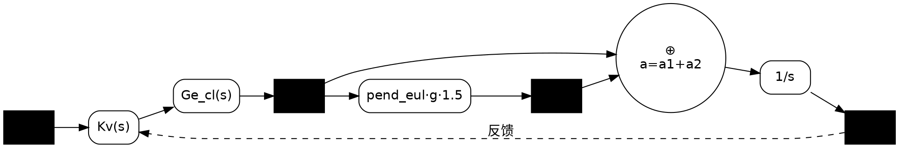

# ctl_pendulum_osc.m — 起重机提升系统与摆动耦合动力学分析

## 1. 概述

`ctl_pendulum_osc.m` 是一个 MATLAB 脚本，用于建立并分析一个**三层级联控制回路**（旋转 → 俯仰/高度 → 速度）与**单摆负载摆动**之间的耦合动力学模型。脚本通过传递函数和状态空间方法，计算闭环特性、绘制 Bode 图，并进行时域仿真，以验证控制回路对摆动的影响。

---

## 2. 系统架构

整体系统由外到内分为三个级联回路，最终与单摆负载动力学耦合。下面是 Mermaid 格式的框图，方便你在支持 Mermaid 的渲染器中查看：

```mermaid
graph LR
    subgraph 内环_旋转回路
        direction LR
        eul_err["⊕"] --> Kr["Kr(s)"]
        Kr --> Gr["Gr(s)"]
        Gr --> angle["angle"]
        angle -->|反馈| eul_err
    end

    subgraph 中环_高度回路
        direction LR
        h_err["⊕"] --> Ke["Ke=6"]
        Ke --> Gr_cl["Gr_cl(s)"]
        Gr_cl --> eul["eul"]
        eul -->|1/gain| h_fb[""]
        h_fb -->|反馈| h_err
    end

    subgraph 外环_速度回路
        direction LR
        v_err["⊕"] --> Kv["Kv(s)"]
        Kv --> Ge_cl["Ge_cl(s)"]
        Ge_cl --> a1["a1"]
    end

    subgraph 摆动耦合
        direction LR
        a1_in["a1"] --> pend["pend_eul(s)·g·1.5"]
        pend --> a2["a2"]
    end

    subgraph 整体求和与积分
        direction LR
        sum["⊕<br/>a=a1+a2"] --> Int["1/s"]
        Int --> v["v"]
        v -->|反馈| v_err
        a2 --> sum
    end

    r["r"] --> v_err
    a1 --> sum
    a1 --> a1_in

    style r fill:#f9f,stroke:#333
    style v fill:#bbf,stroke:#333
    style a1 fill:#bfb,stroke:#333
    style a2 fill:#fbb,stroke:#333
```

> 如果渲染器不支持 Mermaid，下方也提供了 **Graphviz DOT** 格式，可用 `dot -Tpng` 自行渲染：



完整互联后的系统输入为位置指令 `r`，输出为速度 `v`、回路加速度 `a1` 和摆动耦合加速度 `a2`。

### 信号物理含义（来自 `.m` 代码原始框图注释）

```matlab
%% plant
%
%                                                 +-------------------------|
%               a       eul     eul         a1    | a                       |
%  r--->o--->Kv--->gain----->P------>1/gain--+--->o--->1/s----->y           |
%       |                                    |              |               |
%       -------------------------------------+---------------               |
%                                            |                              |a2
%                                            +--->pend---->w,eul----gain1---+
%
%   gain1: w^2*l*eul*m/M
```

```python
%% plant
%                                                    a2
%                                                 +------------------------------|
%               a       eul     eul         a1    |                              |
%  r--->o--->Kv--->gain----->P------>1/gain------>o--->1/s----->y                |
%       |                                         | a           |                |
%       ------------------------------------------+--------------                |
%                                                 |                              |
%                                                 +--->pend---->w,eul----gain1---+
%
%   gain1: w^2*l*eul*m/M
```

| 信号 | 物理含义 |
|------|---------|
| **r** | 速度指令 [m/s]，外环输入。 |
| **e** / `v_err` | 速度误差，`e = r - v`。外环求和节点 `v_err` 的输出。 |
| **Kv** | 速度控制器，`Kv(s) = pid(0.5, 0.02, 0) · (1 + 0.6s)`，输入 `e`，输出经 `gain` 缩放后变成俯仰角指令。 |
| **gain** | 单位转换因子，`gain = 1/g/180·π ≈ 0.00178`，把 `Kv` 的输出从速度/加速度域映射到角度域 [deg]。 |
| **Gr** | 旋转被控对象，`Gr(s) = 2/s / (s/(4π) + 1)`。输入为转矩/控制量，输出为俯仰角，含一个积分环节和一个 2 Hz 低通。 |
| **Kr** | 旋转控制器，`Kr(s) = pid(0.1, 0.1, 0) · (s+100)/(s+1) · 100`。PID 串领先补偿，输出为旋转控制量。 |
| **eul_err** | 旋转回路误差，`eul_err = 0 - angle`（期望俯仰角为 0 时）。求和节点 `⊕`。 |
| **angle** / `eul` | 无人机俯仰角 [rad]，由旋转闭环 `Gr_cl` 控制，是 `Ge_cl` 的中间输出。内环节点叫 `angle`，中环节点叫 `eul`，物理含义相同。 |
| **Gr_cl** | 旋转闭环传递函数，`Gr_cl = feedback(Gr·Kr, 1)`。输入俯仰角误差，输出俯仰角。 |
| **h_err** | 高度回路误差，`h_err = h_ref - h`。求和节点 `⊕`（期望高度为某常值时）。 |
| **Ke** | 高度控制器比例增益，`Ke = 6`。把高度误差映射为俯仰角指令。 |
| **h_fb** | 高度反馈通道，含 `1/gain` 缩放，把俯仰角 `eul` 映射回高度量纲。 |
| **Ge** | 高度开环传递函数，`Ge = Gr_cl / s`，在旋转闭环基础上增加一个积分，把俯仰角积分为高度。 |
| **Ge_cl** | 高度闭环传递函数，`Ge_cl = feedback(Ge·Ke, 1)·filt2`。输入高度误差，输出俯仰角/加速度等效量。 |
| **P** | 速度-高度合并传递函数，`P = Kv·gain·Ge_cl/gain = Kv·Ge_cl`。等价于速度控制器串联高度闭环，输入 `e`，输出 `a1`。 |
| **a1** | 控制器输出的**名义加速度** [m/s²]。`a1 = P·e`，是速度控制器经高度闭环后产生的加速度指令，**不考虑摆动影响**。 |
| **a2** | 摆动产生的**惯性耦合加速度** [m/s²]。`a2 = pend·a1`，是单摆受 `a1` 驱动后，通过吊绳反馈给无人机的附加加速度。 |
| **a** | 实际总加速度 [m/s²]。在 `.m` 原版中 `a = a1 + a2`；在物理正确的稳定版中应为 `a = a1 - a2`（摆动是阻力）。 |
| **1/s (Inte)** | 积分器，把总加速度 `a` 积分为无人机速度 `v`。 |
| **v** | 无人机速度 [m/s]，`v = ∫a dt`，反馈回外环与 `r` 比较。 |
| **y** | `.m` 代码注释中的 `y`，等价于 `v`（速度输出）。 |
| **pend** / `pend_eul` | 单摆动力学传递函数，`pend = -pend_eul·g·1.5`，输入 `a1`，输出 `a2`。`pend_eul` 本身是把 `a1` 映射为单摆响应的欧拉近似模型。 |
| **w** | 单摆角速度 [rad/s]，`pend_tf(2)` 的输出。 |
| **eul**（单摆） | 单摆摆角 [rad]，`pend_tf(1)` 的输出，0 = 竖直向下。 |
| **gain1** | `.m` 注释中的经验系数，`gain1 = w²·l·eul·m/M`，但代码中简化为固定增益 `1.5`。 |

---

## 3. 各模块数学模型

### 3.1 内环：旋转动力学 (`Gr`) 与控制器 (`Kr`)

| 符号 | 表达式 | 说明 |
|------|--------|------|
| `Gr` | `2/s / (1/(2π·2)·s + 1)` | 旋转被控对象，含一个积分环节和一个 2 Hz 低通 |
| `Kr` | `pid(0.1, 0.1, 0) · (1/(2π·2)·s+1)/(1/(2π·20)·s+1) · 100` | PID 控制器 + 2→20 Hz 高频提升 + 增益 100 |
| `Gr_cl` | `feedback(Gr·Kr, 1)` | 闭环旋转传递函数 |

### 3.2 中环：高度回路 (`Ge_cl`)

| 符号 | 表达式 | 说明 |
|------|--------|------|
| `Ge` | `Gr_cl / s` | 旋转闭环后经积分得到高度 |
| `Ke` | `6` | 高度环比例增益 |
| `filt2` | 数字滤波器 `d2c(...)` 转连续域 | 采样周期 0.0025 s 的离散滤波器 |
| `Ge_cl` | `feedback(Ge·Ke, 1) · filt2` | 闭环高度传递函数（含滤波） |

### 3.3 外环：速度回路 (`Gv_cl`)

| 符号 | 表达式 | 说明 |
|------|--------|------|
| `Gv` | `Ge_cl / s` | 高度闭环后再积分得到速度 |
| `Kv` | `pid(0.5, 0.02, 0) · (1 + 0.6·s)` | PI 控制器 + 超前补偿 |
| `Gv_cl` | `feedback(Gv·Kv, 1)` | 闭环速度传递函数 |

### 3.4 单摆负载动力学

采用标准单摆线性化模型（小角度假设）：

```
A = [0      1;
     -g/l   0]       % l = 10 m, g = 9.81 m/s²
B = [0; 1/l]
C = eye(2)
D = 0
```

| 输出 | 传递函数 | 物理意义 |
|------|----------|----------|
| `pend_eul` | `pend_tf(1)` | 摆角 θ（rad）对无人机加速度的响应 |
| `pend_w` | `pend_tf(2)` | 角速度 ω 对无人机加速度的响应 |

> 注意：脚本中 `pend_tf = -tf(pend_ss)`，即加速度正方向与摆角正方向的符号约定经过反转。

---

## 4. 完整闭环连接

脚本使用 MATLAB `connect` 将以下模块按框图互联：

| 模块 | 输入 | 输出 | 说明 |
|------|------|------|------|
| `P` | `e` | `a1` | 速度控制器 + 高度闭环 + 增益缩放 |
| `pend` | `a1` | `a2` | 摆角 → 耦合加速度反馈 |
| `Inte` | `a` | `v` | `1/s`，速度积分 |
| `S2` | — | — | `e = r - v`（速度误差求和） |
| `S1` | — | — | `a = a1 + a2`（总加速度求和） |

最终得到多输入多输出闭环模型：

```matlab
T = connect(P, pend, Inte, S1, S2, {'r'}, {'v', 'a1', 'a2'})
```

- **输入**：位置/速度指令 `r`
- **输出**：`v`（速度）、`a1`（控制器输出加速度）、`a2`（摆动耦合加速度）

---

## 5. 脚本运行结果

执行脚本后，会产生以下图形输出：

1. **Bode 图** (`bode(T)`)  
   显示从 `r` 到 `[v, a1, a2]` 的闭环频率响应，用于评估带宽、谐振峰和稳定性裕度。

2. **时域响应图** (`lsim`)  
   在 `t = 0 ~ 10 s`、输入 `u = 0`（零输入）条件下，给定初始摆角 `x0(10) = -30°`：
   - 子图 1：速度 `v` 与指令 `r`
   - 子图 2：控制器加速度 `a1`
   - 子图 3：摆动耦合加速度 `a2`

   该仿真展示了**零输入下的自由摆动衰减过程**，以及控制回路对摆动的抑制/耦合特性。

---

## 6. 关键参数速查

| 参数 | 数值 | 说明 |
|------|------|------|
| 摆长 `l` | 10 m | 吊绳长度 |
| 重力 `g` | 9.81 m/s² | |
| 高度环增益 `Ke` | 6 | |
| 旋转 PID | `Kp=0.1, Ki=0.1, Kd=0` | |
| 速度 PID | `Kp=0.5, Ki=0.02, Kd=0` | 含 `(1+0.6s)` 超前补偿 |
| 初始摆角 | -30° | 时域仿真初始条件 |
| 摆动耦合增益 | `1.5` | `pend` 模块中的经验系数 |

---

## 7. 使用说明

### 7.1 运行环境
- MATLAB（推荐 R2016b 及以上，需 Control System Toolbox）

### 7.2 运行步骤
```matlab
cd src/dynamics
ctl_pendulum_osc
```

### 7.3 常见用途
- **快速评估**：修改 `Kv`、`Ke` 或摆长 `l`，观察闭环 Bode 图变化。
- **初始条件测试**：调整 `x0(10)` 的初始摆角，查看摆动衰减时间。
- **参数辨识对比**：将仿真得到的 `a1`、`a2` 与实际 Crane IMU 数据对比，验证模型参数。

---

## 8. 与项目其他模块的关系

| 文件/模块 | 关联说明 |
|-----------|----------|
| `data/crane_imu_obs*.csv` | 实际 IMU 观测数据，可与本脚本仿真结果对比验证 |
| `src/observer/` | 若引入状态观测器，可将本脚本中的 `pend_ss` 作为观测器设计对象 |
| `src/controller/` | C++ 实现的 LQR/MPC 控制器，其设计可参考本脚本得到的闭环带宽和摆动频率 |

---

## 9. Python 时域仿真

项目已提供与 `.m` 代码逐句对应的 Python 时域仿真脚本，无需 MATLAB 即可运行。

### 9.1 依赖
```bash
source .venv/bin/activate
pip install control
```

### 9.2 脚本位置
`scripts/simulation/run_ctl_pendulum_osc.py`

### 9.3 使用方式

**默认：零输入自由响应**
```bash
python3 scripts/simulation/run_ctl_pendulum_osc.py --dt 0.01 --t-final 10
```

**从 CSV 读取速度指令序列**
```bash
python3 scripts/simulation/run_ctl_pendulum_osc.py --csv-input speed_profile.csv --dt 0.01
```

CSV 格式（两列，无额外空格）：
```csv
time_s,r_m_s
0.0,0.0
1.0,1.0
5.0,1.0
10.0,0.0
```

**自定义输出路径**
```bash
python3 scripts/simulation/run_ctl_pendulum_osc.py \
    --csv-input speed_profile.csv \
    --out-csv results/my_sim.csv \
    --out-png results/my_sim.png
```

### 9.4 输出结果
- **CSV**：`results/ctl_pendulum_osc/ctl_pendulum_osc.csv`
  - 列：`time_s, r_m_s, v_m_s, a1_m_s2, a2_m_s2, theta_rad, theta_dot_rad_s`
- **PNG**：四子图（r-v、r-a1、r-a2、r-theta）

### 9.5 重要提示：闭环稳定性

按照 `.m` 代码的原始参数和框图（`a = a1 + a2`，摆动耦合增益 `1.5`）翻译得到的完整闭环系统 **包含不稳定极点**（约 `0.18 ± j1.19 rad/s`）。这意味着：

- **零输入 + 零初始条件**：所有输出保持为零（符合线性系统理论）。
- **非零速度指令输入**：响应会随时间指数发散。
- **不含摆动的速度回路 `Gv_cl`**：单独看是稳定的。

如果你需要一个**稳定**的时域仿真模型用于实际轨迹验证，需要调整摆动耦合结构（例如将 `a = a1 + a2` 改为 `a = a1 - a2`，或降低耦合增益 `< 0.5`），但这会偏离 `.m` 代码的原始设计。

---

## 10. 备注

- 脚本中的 `gain = 1/g/180*pi` 为弧度/角度转换与重力加速度的复合缩放因子，用于将控制器输出映射到物理加速度单位。
- `filt2` 来源于离散域滤波器，表明原始控制器设计可能先在数字域完成，再转到连续域分析。
- 部分代码被注释掉（如 `bode(r2pend)`、`step(T*filter)` 等），可根据需要取消注释以获得更多中间分析结果。
- Python 脚本中 `filt2` 的连续等效通过 Tustin 逆变换得到，与原始离散系统的频率响应误差 `< 0.001 dB`。
