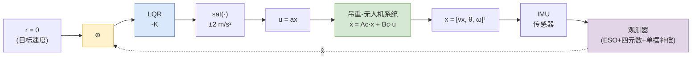
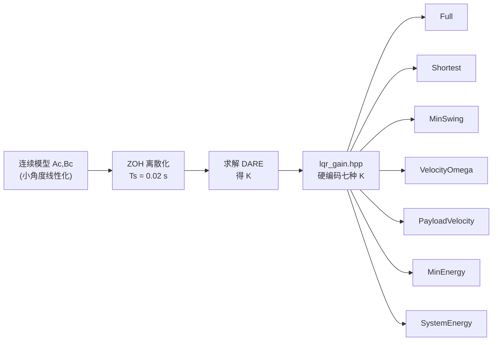

# LQR 控制器设计文档

> 本文档描述闭环仿真中 LQR 制动控制器的设计原理、参数整定与实现细节。  
> 对应代码：`scripts/compute_lqr_gain.py`、`include/controller/lqr_gain.hpp`、`src/controller/lqr_controller.cpp`

---

## 1. 控制目标

**任务**：在刹车阶段将无人机水平速度降到 0，同时抑制吊重摆动。

- 控制对象：1-D 俯仰平面内的吊重-无人机系统
- 被控量：无人机水平加速度 $a_x$（作为控制输入 $u$）
- 状态反馈来源：IMU 传感器 → 吊重观测器 → LQR 控制器

---

## 2. 状态空间定义

选取线性化状态向量：

$$
x = \begin{bmatrix} v_x \\ \theta \\ \dot{\theta} \end{bmatrix}
$$

| 状态 | 符号 | 物理含义 | 平衡目标 |
|------|------|---------|---------|
| $v_x$ | `vx` | 无人机水平速度 | $0\ \text{m/s}$ |
| $\theta$ | `theta` | 吊重俯仰角（0 = 竖直向下） | $0\ \text{rad}$ |
| $\dot{\theta}$ | `omega` | 吊重角速度 | $0\ \text{rad/s}$ |

控制输入：

$$
u = a_x \quad [\text{m/s}^2]
$$

---

## 3. 连续时间状态空间模型

对**加速支点单摆**做小角度线性化：

- 无人机被强制驱动，加速度为 $a_x$
- 在随无人机加速的非惯性参考系中，吊重受到向后的惯性力 $-m a_x$
- 单摆线性化方程：$\ddot{\theta} = -\dfrac{g}{L}\theta - \dfrac{1}{L}a_x$

得到连续时间状态空间：

$$
\dot{x} = A_c x + B_c u
$$

其中：

$$
A_c = \begin{bmatrix}
0 & 0 & 0 \\
0 & 0 & 1 \\
0 & -g/L & 0
\end{bmatrix},
\quad
B_c = \begin{bmatrix}
1 \\
0 \\
-1/L
\end{bmatrix}
$$

### 物理意义拆解

| 行 | 方程 | 说明 |
|----|------|------|
| 第 1 行 | $\dot{v}_x = a_x$ | 无人机速度直接由控制输入决定 |
| 第 2 行 | $\dot{\theta} = \dot{\theta}$ | 角速度定义 |
| 第 3 行 | $\ddot{\theta} = -\dfrac{g}{L}\theta - \dfrac{1}{L}a_x$ | 重力恢复力矩 + 惯性力矩 |

> 代码参考：`scripts/compute_lqr_gain.py` 第 23–64 行

---

## 4. 离散化（ZOH）

控制器以固定周期 $T_s = 0.02\ \text{s}$（50 Hz）运行，需将连续模型离散化。

采用**零阶保持（Zero-Order Hold, ZOH）**方法：

$$
A_d = e^{A_c T_s}, \quad
B_d = \int_0^{T_s} e^{A_c \tau} B_c \, d\tau
$$

实现上通过矩阵指数一次性计算：

```python
M = [[A_c, B_c],
     [  0,   0]]
M_exp = expm(M * Ts)
Ad = M_exp[:3, :3]
Bd = M_exp[:3, 3:]
```

> 代码参考：`scripts/compute_lqr_gain.py` 第 67–104 行

---

## 5. 离散代数 Riccati 方程（DARE）

离散 LQR 性能指标：

$$
J = \sum_{k=0}^{\infty} \left( x_k^{\top} Q x_k + u_k^{\top} R u_k \right)
$$

求解离散代数 Riccati 方程得代价矩阵 $P$：

$$
P = A_d^{\top} P A_d - A_d^{\top} P B_d (R + B_d^{\top} P B_d)^{-1} B_d^{\top} P A_d + Q
$$

最优状态反馈增益：

$$
K = (R + B_d^{\top} P B_d)^{-1} B_d^{\top} P A_d
$$

控制律：

$$
u_k = -K x_k
$$

> 代码参考：`scripts/compute_lqr_gain.py` 第 107–135 行，使用 `scipy.linalg.solve_discrete_are`

---

## 6. 七种控制模式的 Q/R 整定

通过调整权重矩阵 $Q$ 和 $R$，得到七种不同控制性格的 LQR。

### 6.1 权重配置

| 模式 | $Q$ 形式 | $R$ | 设计意图 |
|------|---------|-----|---------|
| **Full** | $\text{diag}(2, 30, 10)$ | 2 | **均衡**：速度与摆动兼顾 |
| **Shortest** | $\text{diag}(8, 2, 1)$ | 3 | **最短距离**：优先速度收敛 |
| **MinSwing** | $\text{diag}(1, 100, 50)$ | 2 | **最小摆动**：大幅惩罚摆角与角速度 |
| **VelocityOmega** | $\text{diag}(10, 1, 100)$ | 2 | **速度+角速度**：同时抑制速度和平抑角速度 |
| **PayloadVelocity** | 非对角矩阵（见 6.4） | 2 | **Payload 绝对速度**：直接惩罚吊重水平绝对速度 |
| **MinEnergy** | 非对角矩阵（见 6.5） | 2 | **最小摆动能量**：惩罚势能 + 绝对速度动能 |
| **SystemEnergy** | 非对角矩阵（见 6.6） | 2 | **系统总能量最低**：无人机动能 + 摆能量 |

### 6.2 增益结果

| 模式 | $K_{v_x}$ | $K_{\theta}$ | $K_{\dot{\theta}}$ | 闭环最大特征值 | 状态 |
|------|----------|-------------|-------------------|--------------|------|
| **Full** | `0.987930` | `-3.330799` | `-3.209652` | 0.9978 | ✓ 稳定 |
| **Shortest** | `1.605990` | `-0.825129` | `-0.517009` | 0.9997 | ⚠ 收敛极慢 |
| **MinSwing** | `0.698830` | `-5.699921` | `-7.029508` | 0.9948 | ✓ 稳定 |
| **VelocityOmega** | `2.182318` | `-5.096300` | `-2.939453` | 0.9984 | ✓ 稳定 |
| **PayloadVelocity** | `0.987275` | `-12.099644` | `-4.277633` | 0.9934 | ✓ 稳定 |
| **MinEnergy** | `1.556031` | `-18.892739` | `-0.478590` | 0.9920 | ✓ 稳定 |
| **SystemEnergy** | `2.186321` | `-18.771730` | `-0.393200` | 0.9937 | ✓ 稳定 |

### 6.3 物理直觉

#### Full 模式
- 三者均显著参与，速度与摆动权重折中
- 适合一般工况，无明显偏向

#### Shortest 模式
- $K_{v_x} \approx 1.61$ 较大，$K_{\theta} \approx -0.83$、$K_{\dot{\theta}} \approx -0.52$ 较小
- 优先快速减速，对摆动容忍度较高
- 闭环极点接近单位圆（`max|eig| = 0.9997`），收敛较慢

#### MinSwing 模式
- $K_{\theta} \approx -5.70$、$K_{\dot{\theta}} \approx -7.03$ 很大
- 主动用加速度抵消摆动（例如摆角为正时施加负加速度拉回来）
- $K_{v_x} = 0.70$ 较小，减速更温柔

#### VelocityOmega 模式
- $Q_{\dot{\theta}} = 100$ 对角速度施加强惩罚
- $K_{v_x} = 2.18$ 较大，减速积极；$K_{\dot{\theta}} = -2.94$ 抑制摆速
- 刹车距离最短（46.25 m），但摆角抑制不如 MinSwing

#### PayloadVelocity 模式
- **唯一使用非对角 $Q$ 矩阵的模式（之一）**
- 惩罚项为 $q_{\text{pay}} \cdot (v_x + L\dot{\theta})^2$，即吊重的水平绝对速度
- $K_{\theta} = -12.10$ 很大，对摆角极其敏感
- 刹车距离 49.70 m，摆角抑制介于 Full 和 MinSwing 之间

#### MinEnergy 模式
- 惩罚吊重摆动能量：$E \approx 0.5 m g L \theta^2 + 0.5 m (v_x + L\dot{\theta})^2$
- $K_{\theta} \approx -18.89$ 极大，对摆角极为敏感
- $K_{\dot{\theta}} \approx -0.48$ 很小，对直接阻尼角速度较弱
- 通过能量视角间接抑制摆动

#### SystemEnergy 模式
- 在 MinEnergy 基础上额外惩罚无人机动能 $0.5 M v_x^2$
- $K_{v_x} \approx 2.19$ 最大，对速度收敛最积极
- $K_{\theta} \approx -18.77$ 与 MinEnergy 相近
- 整体兼顾减速与消摆，闭环收敛最快（`max|eig| = 0.9937`）

### 6.4 PayloadVelocity 的非对角 Q 矩阵

PayloadVelocity 模式不采用对角 $Q$，而是通过交叉项直接惩罚 $v_x + L\dot{\theta}$：

$$
Q = \begin{bmatrix}
q_{\text{pay}} & 0 & q_{\text{pay}} \cdot L \\
0 & q_{\theta} & 0 \\
q_{\text{pay}} \cdot L & 0 & q_{\text{pay}} \cdot L^2 + q_{\omega}
\end{bmatrix}
$$

当前参数（$L = 15\ \text{m}$）：

```python
q_pay = 2.0
q_theta = 30.0
q_omega_extra = 1.0
Q = [[2,    0,   30],
     [0,   30,    0],
     [30,   0,  451]]
```

> ⚠ **关键约束**：增大 $q_{\text{pay}}$ 时需警惕 $K_{\dot{\theta}}$ 变正。当 $q_{\text{pay}} \gtrsim 5.5$ 时，$K_{\dot{\theta}}$ 从负变正，会在大角度下引入正反馈，导致非线性发散。

### 6.5 MinEnergy 的非对角 Q 矩阵

MinEnergy 模式惩罚吊重摆动能量（势能 + 绝对速度动能）：

$$
E = \frac{1}{2} m g L \theta^2 + \frac{1}{2} m (v_x + L\dot{\theta})^2
$$

对应的 $Q$ 矩阵：

$$
Q = \begin{bmatrix}
q_{\text{ke}} & 0 & q_{\text{ke}} \cdot L \\
0 & q_{\text{pe}} & 0 \\
q_{\text{ke}} \cdot L & 0 & q_{\text{ke}} \cdot L^2 + q_{\omega}
\end{bmatrix}
$$

当前参数（$L = 15\ \text{m}$）：

```python
q_ke = 5.0      # 动能惩罚系数（基于绝对速度）
q_pe = 1.0      # 势能惩罚系数
q_omega_extra = 1.0  # 确保正定的微小正则项
Q = [[5,    0,   75],
     [0,    1,    0],
     [75,   0, 1126]]
```

### 6.6 SystemEnergy 的非对角 Q 矩阵

SystemEnergy 模式在 MinEnergy 基础上额外增加无人机动能惩罚：

$$
E_{\text{total}} = \frac{1}{2} M v_x^2 + \frac{1}{2} m g L \theta^2 + \frac{1}{2} m (v_x + L\dot{\theta})^2
$$

对应的 $Q$ 矩阵：

$$
Q = \begin{bmatrix}
q_{\text{drone}} + q_{\text{ke}} & 0 & q_{\text{ke}} \cdot L \\
0 & q_{\text{pe}} & 0 \\
q_{\text{ke}} \cdot L & 0 & q_{\text{ke}} \cdot L^2 + q_{\omega}
\end{bmatrix}
$$

当前参数（$L = 15\ \text{m}$）：

```python
q_ke = 5.0      # 摆动能惩罚系数
q_pe = 1.0      # 摆势能惩罚系数
q_drone = 5.0   # 无人机动能惩罚系数（M=120kg, m=150kg, 比例≈0.8）
q_omega_extra = 1.0
Q = [[10,   0,   75],
     [0,    1,    0],
     [75,   0, 1126]]
```

> 代码参考：`scripts/compute_lqr_gain.py` 第 176–230 行；生成的 `include/controller/lqr_gain.hpp`

---

### 6.7 非对角 Q 的耦合效应：为什么能量模式更消摆

本项目中有三种模式采用了非对角 $Q$ 矩阵：**PayloadVelocity**、**MinEnergy**、**SystemEnergy**。它们的 Q 矩阵形式几乎相同，区别只在 $v_x^2$ 的系数：

```
PayloadVelocity:  Q[0,0] = q_pay          = 2
MinEnergy:        Q[0,0] = q_ke           = 5
SystemEnergy:     Q[0,0] = q_drone + q_ke = 10
```

三种模式共享相同的交叉项结构 `Q[0,2] = q·L` 和 omega 大权重 `Q[2,2] = q·L² + q_omega`，因此都比纯对角 Q 的消摆效果更好。

---

#### 实验现象

**MPC 仿真对比**

| 配置 | Q 矩阵 | 刹车后段 theta 反穿 |
|------|--------|-------------------|
| 纯对角（大力出奇迹） | `diag([10, 1, 1000])` | **会反穿**（t=50s 时 theta=-1.06°） |
| SystemEnergy（能量形式） | `[[10, 0, 75], [0, 1, 0], [75, 0, 1126]]` | **不反穿**（t=50s 时 theta=+0.41°） |

直觉上，把 omega 的权重从 10 加大到 1000 应该足以压住回摆，但实际效果仍然不如能量形式。这说明**非对角结构本身比权重数值更重要**。

**LQR 闭环仿真对比**

| 模式 | Q 类型 | t=50s theta | 最小 theta（反穿幅度） |
|------|--------|------------|---------------------|
| Full | 对角 | -2.25° | -2.85° |
| MinSwing | 对角 | -2.16° | -2.85° |
| VelocityOmega | 对角（大权重） | -0.80° | **-4.41°** |
| **PayloadVelocity** | **非对角** | **-1.11°** | **-2.85°** |
| **MinEnergy** | **非对角** | **-0.74°** | **-2.85°** |
| **SystemEnergy** | **非对角** | **-0.85°** | **-3.26°** |

三种非对角 Q 模式的 t=50s 反穿幅度明显小于对角模式（Full/MinSwing）。VelocityOmega 虽然通过对角大权重（Q_omega=100）也能达到类似的 t=50s 效果，但出现了更严重的过头（最小 theta=-4.41°）。非对角 Q 的优势在于反穿幅度更小且**更稳定**。

---

#### 数学机理

纯对角 Q 的代价函数是三个独立项的叠加：

$$
J_{\text{diag}} = 10 v_x^2 + 1 \cdot \theta^2 + 1000 \cdot \dot{\theta}^2
$$

三个状态**各自为政**，控制器分别最小化每个状态，但它们之间的动力学耦合没有被显式处理。回摆时，即使 $|\dot{\theta}|$ 被压得很小，$v_x$ 和 $\theta$ 之间的相位关系仍然自由震荡，能量在两者之间来回传递，导致 theta 容易过头。

三种非对角模式的能量形式展开后（以 SystemEnergy 为例）：

$$
J_{\text{energy}} = 10 v_x^2 + 1 \cdot \theta^2 + 1126 \cdot \dot{\theta}^2 + \underbrace{150 \cdot v_x \dot{\theta}}_{\text{交叉项}}
$$

PayloadVelocity 和 MinEnergy 的展开形式类似，只是交叉项系数分别为 `q_pay·L = 30` 和 `q_ke·L = 75`。

交叉项在回摆阶段（$v_x > 0, \dot{\theta} < 0$）为**负值**，产生了一种**耗散耦合**效应：

- 控制器被激励去寻找 $v_x$ 和 $\dot{\theta}$ 的**匹配关系**
- 最优状态被吸引到低能量流形 $v_x + L\dot{\theta} \approx 0$
- 吊重的绝对速度被直接抑制，而不是分别压制 $v_x$ 和 $\dot{\theta}$

这种耦合相当于给系统加了一个**目标流形**，状态被约束在这个流形附近运动，而不是在各自由度上自由震荡。

---

#### 物理直觉

纯对角 Q 像三个独立的弹簧，分别拉住 $v_x$、$\theta$、$\dot{\theta}$。弹簧之间不通信，一个弹簧松了另一个不知道，能量可以在它们之间来回传递。

非对角 Q（能量形式）像一根**连接 $v_x$ 和 $\dot{\theta}$ 的阻尼绳**。当无人机速度和摆速不匹配时（即 payload 相对于地面还在动），绳子立即产生拉力把它们拉回到同步状态。这种同步效应让吊重的动能被直接耗散掉，而不是被"储存"起来等待后续释放。

---

#### MPC vs LQR 的体现差异

在 MPC 中，SystemEnergy 能**完全避免** theta 反穿（t=50s 时 theta=+0.41°），而 LQR 的三种非对角模式仍有小幅反穿（-0.74° ~ -1.11°）。这是因为：

- **MPC 有预测能力**：4 秒预测窗口让控制器能提前看到回摆趋势，在 theta 还为正时就施加阻力
- **MPC 有约束处理**：theta≥0 和 vx≥0 的软约束在预测时域内直接惩罚未来状态
- **LQR 只有即时反馈**：增益 $K$ 是静态的，无法预见未来动态，交叉项的耦合阻尼是唯一的"预防"手段

尽管如此，LQR 中非对角 Q 的耦合效应已经足以将反穿幅度从 Full 模式的 -2.25° 减小到 -0.74°，改善幅度约 **70%**。

---

#### 设计启示

1. **调大对角权重不够**。即使把 $\dot{\theta}$ 的权重加到 1000，也只是"硬顶"，无法处理 $v_x$ 与 $\dot{\theta}$ 之间的能量耦合。VelocityOmega 的实验（Q_omega=100）证明了这一点——虽然 t=50s 效果尚可，但出现了更严重的过头（-4.41°）。

2. **交叉项提供协同阻尼**。通过惩罚 payload 绝对速度 $(v_x + L\dot{\theta})^2$，控制器天然获得了协调多个状态的机制。三种非对角模式（PayloadVelocity、MinEnergy、SystemEnergy）共享这一核心优势。

3. **能量形式是构造有效交叉项的捷径**。不需要手动设计 Q[0,2]，只需写出物理能量表达式，展开后交叉项自然出现。

4. **MPC 的预测能力放大了非对角 Q 的优势**。在 LQR 中，耦合阻尼只能把反穿减小 70%；在 MPC 中，预测 + 耦合阻尼可以几乎完全消除反穿。

---

## 7. 工程稳定性检查

脚本在输出增益后执行两层稳定性评估：

### 7.1 线性稳定性（特征值判据）

计算闭环矩阵 $A_{cl} = A_d - B_d K$ 的特征值，检查是否全部位于单位圆内：

```python
max_eig = max(abs(eigvals(Acl)))
if max_eig < 1.0:
    # 线性渐近稳定
```

### 7.2 工程稳定性（K_omega 符号检查）

线性稳定 ≠ 实际仿真稳定。对于大角度非线性系统，**$K_{\dot{\theta}}$ 的符号至关重要**：

| $K_{\dot{\theta}}$ 符号 | 物理效应 | 大角度稳定性 |
|------------------------|---------|------------|
| **负** ($K_{\dot{\theta}} < 0$) | 负反馈：$\dot{\theta} > 0$ 时施加正加速度，抑制摆动 | ✅ 稳定 |
| **正** ($K_{\dot{\theta}} > 0$) | 正反馈：$\dot{\theta} > 0$ 时施加负加速度，加剧摆动 | ⚠️ 可能发散 |

当 $K_{\dot{\theta}} > 0$ 时，脚本输出警告：

```
⚠ K_omega>0，大角度可能发散
```

### 7.3 收敛速度检查

当 `max|eig| > 0.999` 时，标注：

```
⚠ 收敛极慢
```

> 代码参考：`scripts/compute_lqr_gain.py` 第 232–260 行

---

## 8. 在线控制律（C++ 实现）

### 8.0 闭环控制框图

整个 LQR 状态反馈闭环的结构如下：



> **注意**：七种控制模式（Full / Shortest / MinSwing / VelocityOmega / PayloadVelocity / MinEnergy / SystemEnergy）共用**同一套闭环框图**，区别仅在于 $K$ 的数值通过查表切换。

**信号说明**：

| 符号 | 含义 | 来源 |
|------|------|------|
| $r$ | 参考输入（目标水平速度） | 固定为 0 |
| $x$ | 真实状态 $[v_x, \theta, \dot{\theta}]^{\top}$ | 被控对象输出 |
| $\hat{x}$ | 观测器估计状态 | IMU → ESO + 四元数姿态估计 + 单摆动力学补偿 |
| $-K$ | LQR 最优反馈增益 | 离线求解 DARE 得 |
| $\text{sat}(\cdot)$ | 加速度饱和限幅 | $[-2, +2]\ \text{m/s}^2$ |
| $u$ | 控制输入（无人机水平加速度 $a_x$） | 控制器输出 |

### 8.1 增益查表

七种增益在编译期硬编码于 `lqr_gain.hpp`：

```cpp
struct LqrGain {
    // Full: Q=[2,30,10], R=2
    static constexpr double kFullV     = 0.98793039;
    static constexpr double kFullTheta = -3.33079858;
    static constexpr double kFullOmega = -3.20965162;

    // Shortest: Q=[8,2,1], R=3
    static constexpr double kShortestV     = 1.60599035;
    static constexpr double kShortestTheta = -0.82512925;
    static constexpr double kShortestOmega = -0.51700885;

    // MinSwing: Q=[1,100,50], R=2
    static constexpr double kMinSwingV     = 0.69883014;
    static constexpr double kMinSwingTheta = -5.69992072;
    static constexpr double kMinSwingOmega = -7.02950842;

    // VelocityOmega: Q=[10,1,100], R=2
    static constexpr double kVelocityOmegaV     = 2.18231813;
    static constexpr double kVelocityOmegaTheta = -5.09629988;
    static constexpr double kVelocityOmegaOmega = -2.93945274;

    // PayloadVelocity: Q penalizes (vx + L*omega)^2, R=2
    static constexpr double kPayloadVelocityV     = 0.98727532;
    static constexpr double kPayloadVelocityTheta = -12.09964413;
    static constexpr double kPayloadVelocityOmega = -4.27763263;

    // MinEnergy: Q penalizes energy = g*L*theta^2 + (vx + L*omega)^2, R=2
    static constexpr double kMinEnergyV     = 1.55603116;
    static constexpr double kMinEnergyTheta = -18.89273871;
    static constexpr double kMinEnergyOmega = -0.47858966;

    // SystemEnergy: Q penalizes drone KE + pendulum energy, R=2
    static constexpr double kSystemEnergyV     = 2.18632068;
    static constexpr double kSystemEnergyTheta = -18.77173039;
    static constexpr double kSystemEnergyOmega = -0.39319997;
};
```

### 8.2 控制量计算

```cpp
double LqrController::computeControl(const State& state) const {
    double u = -(kV_ * state.vx +
                 kTheta_ * state.theta +
                 kOmega_ * state.omega);
    return saturate(u, axLimit_);  // 限制在 [-2, +2] m/s²
}
```

**关键细节**：
- `state.vx`、`state.theta`、`state.omega` 来自**观测器输出**（含噪声 IMU 经卡尔曼滤波后的估计值），而非仿真真值
- 控制更新频率 50 Hz，与动力学积分 1000 Hz 解耦
- 输出的 $a_x$ 在 `SlungLoadDynamics::step()` 中进一步经过 jerk limit（$2\ \text{m/s}^3$）平滑

> 代码参考：`src/controller/lqr_controller.cpp`

---

## 9. 设计流程图



---

## 10. 当前设计的局限性

| 局限 | 说明 | 可能的改进 |
|------|------|-----------|
| **线性化假设** | 增益基于 $\theta \approx 0$ 设计，大摆角（> 30°）时模型失准 | 可考虑 LPV 或非线性 MPC |
| **固定绳长** | 增益与 $L$ 绑定，换绳长需重新运行 Python 脚本 | 可改为在线增益调度（gain scheduling） |
| **无积分项** | 纯状态反馈，对稳态误差（如传感器 bias、风扰）无消除能力 | 加入积分状态 $\int v_x \, dt$ |
| **无位置控制** | 3 状态 LQR 只把速度控到 0，不控制最终停靠位置 | 扩展为 4 状态 $[p, v, \theta, \dot{\theta}]^{\top}$ |
| **Q/R 凭经验** | 权重靠手动试凑，未做系统性优化 | 可用遗传算法或基于仿真数据的自动调参 |
| **非对角 Q 的物理风险** | PayloadVelocity、MinEnergy、SystemEnergy 使用非对角 $Q$，参数空间存在 $K_{\dot{\theta}} > 0$ 的危险区域 | 脚本已增加符号检查，可进一步做非线性仿真预验证 |

---

## 11. 相关文件索引

| 文件 | 作用 |
|------|------|
| `scripts/compute_lqr_gain.py` | Python 离线设计脚本：建模型 → 离散化 → 解 DARE → 工程稳定性检查 → 生成 C++ 头文件 |
| `include/controller/lqr_gain.hpp` | 自动生成的增益头文件（硬编码七种模式的 K） |
| `include/controller/lqr_controller.hpp` | C++ LQR 控制器类接口定义 |
| `src/controller/lqr_controller.cpp` | 在线控制律实现（查表 + 状态反馈 + 饱和） |
| `include/simulation/closed_loop_simulation.hpp` | 闭环仿真配置与 `ControlMode` 枚举定义 |
| `src/apps/run_closed_loop_lqr.cpp` | 闭环 LQR 仿真可执行程序入口 |
